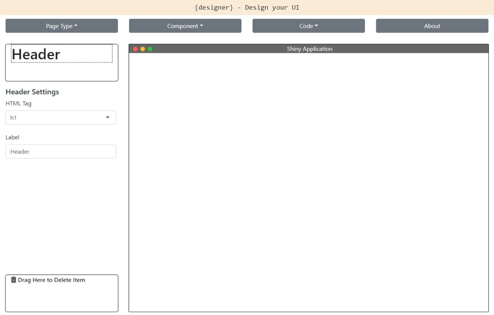
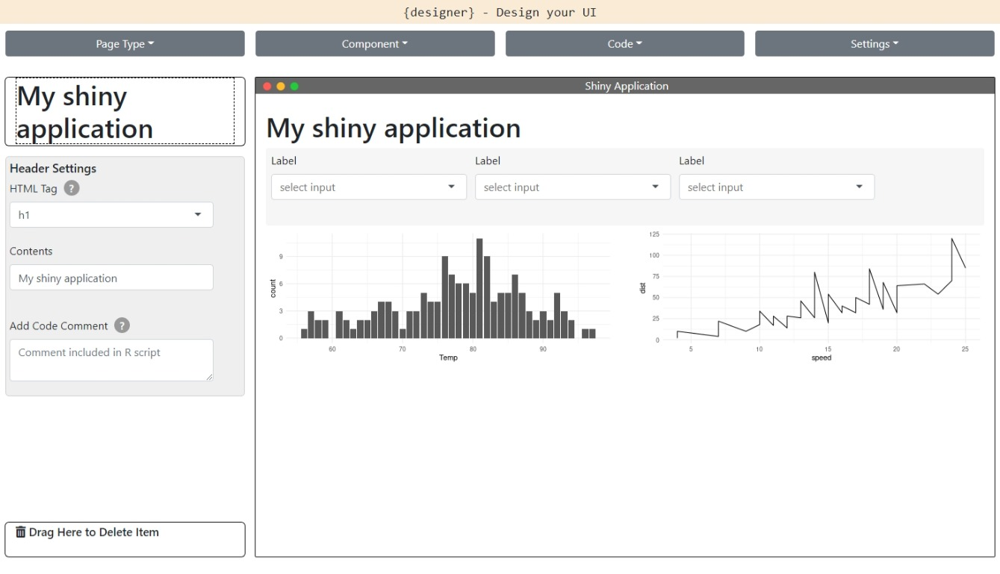

<!-- badges: start -->
[](https://lifecycle.r-lib.org/articles/stages.html#experimental)
[](https://codecov.io/gh/ashbaldry/designer?branch=main)
[](https://github.com/ashbaldry/designer/actions)
<!-- badges: end -->

# {designer} 

`{designer}` is intended to make the initial generation of a UI wireframe of a shiny application as quick and simple as possible. 

The package contains a `shiny` application that enables the user to build the UI of a `shiny` application by drag and dropping several `shiny` components - such as inputs, outputs and buttons - into one of the available pages in the `{shiny}` package. Once finalised, the R code used to generate the UI can be copied or downloaded to a `ui.R` file, and then the rest of the application like the server logic and styling can be built by the developer.

The drag-and-drop nature of the application means that it is easy for both R and non-R users to collaborate in designing the UI of their shiny application. Comments can be added to any component so that it is simple to remember what should be included for each input/output.

## Installation

``` r
# Install the latest version from GitHub:
devtools::install_github("ashbaldry/designer")
```

The application is also available on-line through [shinyapps.io](https://ashbaldry.shinyapps.io/designer).

## Usage

To open the `{designer}` application and create your own UI, run the following code:

``` r
designer::designApp()
```



Once opened, create the application as required until you are happy with the layout of the application, then copy the code to the relevant R file



``` r
# ui.R

basicPage(
  h1(
    "My shiny application"
  ),
  inputPanel(
    selectInput(
      inputId = "dropdown_2tbkzytoo4",
      label = "Label",
      choices = "..."
    ),
    selectInput(
      inputId = "dropdown_98svapo3yc",
      label = "Label",
      choices = "..."
    ),
    selectInput(
      inputId = "dropdown_r4c3gddqt5",
      label = "Label",
      choices = "..."
    )
  ),
  fluidRow(
    column(
      width = 6,
      # Bar plot
      plotOutput(
        outputId = "plot_ck2tg9gny9",
        height = "300px"
      )
    ),
    column(
      width = 6,
      # Line chart
      plotOutput(
        outputId = "plot_wxx1w3h0u7",
        height = "300px"
      )
    )
  )
)
```

## Docker demo
Optionally, you can also build a Dockerized version of the app:

```
sudo docker build -t designer -f Dockerfile .
```

After building the docker image (which should take a while) use the command:

```
docker run -p 80:80 designer
```

Depending on your Docker setup, the exposed application may be available under: http://localhost:80

## Notes

Certain inputs will only include default values and not fully customisable; this is intentional as they are likely to change throughout development and therefore not something that is required at this time of the development process.
