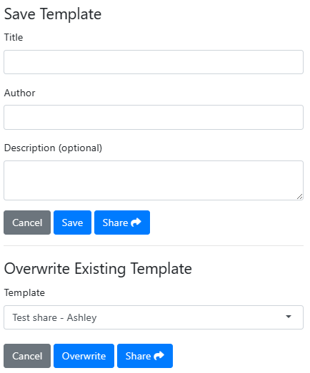

```{r, include = FALSE}
knitr::opts_chunk$set(
  collapse = TRUE,
  comment = "#>"
)
```

One of the key features of `{designer}` introduced in version 0.3.0 is the ability to reuse previously saved templated created in the application.

## Stored Files

By default, the stored layouts will be stored in a shared location so that prototypes can be shared amongst anyone using the same server instance.

The order of selecting the cached location is:

1. The file path assigned to the global variable `R_DESIGNER_CACHE`
2. The site data directory, obtained from `rappdirs::site_data_dir`
3. The user cache directory, obtained from `rappdirs::user_data_dir`

## Storing Templates

Once you have created a template, click on the "Templates" dropdown and select the save option. There a modal will be given asking to give a title and description of the template, as well as the option to supply your name for future reference. From there you can either save the template or share by send the extended URL to others with access to the application. When the load the designer application, the template will be pre-populated in the app.



## Overwriting Exisitng Templates

Whether it is because of discussions with team-mates, or requirements changing, templates will change over time. In the application, there is the ability to overwrite available templates. Clicking on the "Save" button will allow the option to update one of the templates, giving the template title and author.
